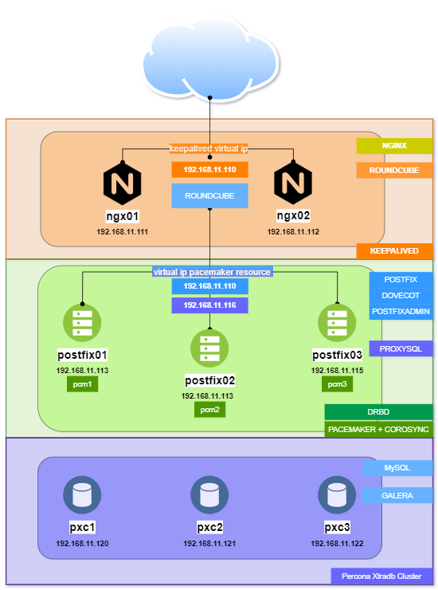

# Выпускной проект курса OTUS Администратор Linux
#### поток 2020-01

## Тема: Отказоустойчивый почтовый сервер на базе postfix + dovecot
#### Создание проекта основано на знаниях, полученных в ходе обучения на курсе.

### Использованные opensource-технологии
* DRBD
* Pacemaker
* Corosync
* Percona XtraDB Cluster (Mysql + Galera)
* Keepalived
* Nginx
* Fastcgi


### Условия, в которых создавался стенд:
* Vagrant v.2.2.7
* ansible v.2.9.7
* VirtualBox v.5.2.36

### Минимальные требования к железу для развертывания
* Intel Core i5
* RAM 16 GB
* Подключение к сети Internet 20 Mbit/s

### Рекомендуемые требования к железу для развертывания
* Intel Core i7
* RAM 16 GB
* Подключение к сети Internet 100 Mbit/s


### В качестве операционной системы на всех хостах стенда используется Centos 7


### Схема стенда



### Описание стенда

Кластер построен из 8-ми хостов. Условно их можно объединить в следующие группы:

* Фронтэнд

* Бэкэнд

* База данных

#### Хосты

| Хост | IP-address |
|------|------------|
| ngx_vip: | 192.168.11.110 |
| ngx01: | 192.168.11.111 |
| ngx02: | 192.168.11.112 |
| postfix01: | 192.168.11.113 |
| postfix02: | 192.168.11.114 |
| postfix03: | 192.168.11.115 |
| proxysql01: | 192.168.11.116 |
| pxc1: | 192.168.11.120 |
| pxc2: | 192.168.11.121 |
| pxc3: | 192.168.11.122 |
| backup: | 192.168.11.123 |


#### Фронтэнд

Состоит из двух нод, на каждой работает Nginx, который посредством fastcgi обеспечивает работу web-приложения Roundcube.
Roundcube подключается к базе данных для аутентификации пользователей и к postfix/dovecot для работы с почтовыми сообщениями.

Для обеспечения отказоустойчивости, на хостах поднят виртуальный ip-адрес силами keepalived в режиме active/backup.


#### Бэкэнд

Самая нагруженная часть кластера. Состоит из 3-х нод, для обеспечения кворума.
Здесь так же в режиме active/backup подняты следующие сервисы:
Drbd
: используется для хранения содержимого почтовых ящиков

* Postfix
: MTA + LDA

* Dovecot
: MDA

* Proxysql
: Проксирует запросы к БД на мастер-ноду кластера Xtradb

* Web-приложение postfixadmin (nginx + fastcgi)
: технический фронтэнд, для управления доменами и почтовыми ящиками.


Отказоусточивость обеспечивается связкой pacemaker + corosync.
Доступность данных в случае отработки фейловера обеспечивает drbd.

##### Древовидная иерархия ресурсов pacemaker:

```
pacemaker
└── DrbdData
    ├── proxysql_ip
    │   └── proxysql
    └── virtual_ip
        ├── dovecot
        └── postfix
```

Таким образом, ключевой ресурс - DrbdData, а все остальные зависят от него.
В случае отработки фейловера, первым на рабочую ноду кластера переезжает drbd (поднимается сервис и монтируется блочное устройство).
Следом за drbd перезжают виртуальные ip:
- virtual_ip для входящих соединений к postfix, dovecot и postfixadmin
- proxysql_ip для входящих соединений к proxysql
В соответствии с тем как это отражено в древовидной структуре, вслед за вирутальными ip на выбранную кворумом ноду переезжают оставшиеся зависимые ресурсы - postfix, dovecot и proxysql.

Для предотвращения сплит-брейна данных на блочном устройстве используется fencing - на каждой ноде поднят фенсинг-агент, предотвращающий работу с распределенным блочным устройством, в случае "выпадения" ноды из кластера.


#### База данных


### Развертывание стенда
Производится путем последовательного выполнения следующих команд:

```
git clone https://github.com/zradeg/otus_project

cd otus_project

vagrant up

ansible-playbook playbook.yml
```


1. postfixadmin setup
http://192.168.11.113/setup.php
Setup password postfix2020
Администратор: admin@postfix.loc
Пароль: произвольный


### В процессе подготовки стенда были использованы следующие материалы:
https://www.linbit.com/drbd-user-guide/drbd-guide-9_0-en/
https://clusterlabs.org/pacemaker/doc/en-US/Pacemaker/1.1/html-single/Clusters_from_Scratch/index.html
https://www.percona.com/doc/percona-xtradb-cluster/LATEST/index.html
https://github.com/roundcube/roundcubemail/wiki
https://postfix-configuration.readthedocs.io/en/latest/postfixadmin/
https://serveradmin.ru/nastroyka-postfix-dovecot-centos-8/
